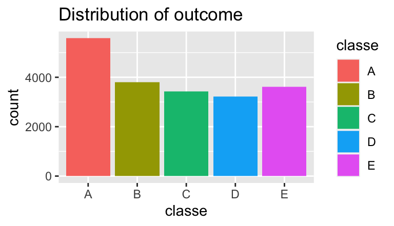

## Overview
A classification model was built to predict from accelerometers data the manner in which one does dumbbell exercises. The selected model is a Random Forest which predicted correctly 95% of the given 20 test samples. This report captures the process taken in building such model. 

## Data
The training data was obtained and loaded into R as follow:

```r
train_link <- "https://d396qusza40orc.cloudfront.net/predmachlearn/pml-training.csv"
download.file(train_link, destfile = "./data/pml-train.csv", method = "curl")
ds.train <- read.csv("./data/pml-train.csv")
dim(ds.train)
```

```
## [1] 19622   160
```
The outcome variable is labeled `classe` and the distribution is fairly balance with Class A having more observations than the rest. 

```r
qplot(x = classe, fill = classe, data = ds.train, ylab = "count", main = "Distribution of outcome")
```


*A - exactly according to the specification  
*B - throwing the elbows to the front  
*C - lifting the dumbbell only halfway  
*D - lowering the dumbbell only halfway 
*E - throwing the hips to the front

### Pre-processing
In the raw dataset, accelerometers data is available for 4 different locations i.e. on the belt, forearm, arm, and dumbbell of the 6 participants that took place in the controlled experiment. For each of the location, there are 38 corresponding variables e.g.   

```r
grep("belt", names(ds.train), value = TRUE)
```

```
##  [1] "roll_belt"            "pitch_belt"           "yaw_belt"            
##  [4] "total_accel_belt"     "kurtosis_roll_belt"   "kurtosis_picth_belt" 
##  [7] "kurtosis_yaw_belt"    "skewness_roll_belt"   "skewness_roll_belt.1"
## [10] "skewness_yaw_belt"    "max_roll_belt"        "max_picth_belt"      
## [13] "max_yaw_belt"         "min_roll_belt"        "min_pitch_belt"      
## [16] "min_yaw_belt"         "amplitude_roll_belt"  "amplitude_pitch_belt"
## [19] "amplitude_yaw_belt"   "var_total_accel_belt" "avg_roll_belt"       
## [22] "stddev_roll_belt"     "var_roll_belt"        "avg_pitch_belt"      
## [25] "stddev_pitch_belt"    "var_pitch_belt"       "avg_yaw_belt"        
## [28] "stddev_yaw_belt"      "var_yaw_belt"         "gyros_belt_x"        
## [31] "gyros_belt_y"         "gyros_belt_z"         "accel_belt_x"        
## [34] "accel_belt_y"         "accel_belt_z"         "magnet_belt_x"       
## [37] "magnet_belt_y"        "magnet_belt_z"
```
More information is available from the website here: <http://web.archive.org/web/20161224072740/http:/groupware.les.inf.puc-rio.br/har> (see the section on the Weight Lifting Exercise Dataset).

The predictors variables in the training dataset has a considerable amount of empty values

```r
sum(is.na(ds.train[, -160]))
```

```
## [1] 1287472
```
hence the variables considered for building this model are the direct measurements from the accelerometers in each plane direction (x, y, z).

```r
accel <- grep("^accel", names(ds.train), value = TRUE)
myvar <- c(accel, "classe")
accel
```

```
##  [1] "accel_belt_x"     "accel_belt_y"     "accel_belt_z"     "accel_arm_x"     
##  [5] "accel_arm_y"      "accel_arm_z"      "accel_dumbbell_x" "accel_dumbbell_y"
##  [9] "accel_dumbbell_z" "accel_forearm_x"  "accel_forearm_y"  "accel_forearm_z"
```
The Principal Component Analysis was applied to the remaining 12 predictor variables, resulting in 8 components needed to capture the 95% of the variance.

```r
prePro <- preProcess(ds.train[, accel], method = "pca")
prePro
```

```
## Created from 19622 samples and 12 variables
## 
## Pre-processing:
##   - centered (12)
##   - ignored (0)
##   - principal component signal extraction (12)
##   - scaled (12)
## 
## PCA needed 8 components to capture 95 percent of the variance
```

## Building Models
Two different models were built and evaluated.  

### Descision tree 'rpart'
The pre-processed PCA components were used to predict a new train dataset to build the `rpart` model on. The model executed 25 Bootstrap repetitions to tune the model.  

```r
trainPC <- predict(prePro, ds.train[, accel])
rpart.fit <- train(classe ~ ., method = "rpart", data = data.frame(trainPC, classe = ds.train$classe))
rpart.fit
```

```
## CART 
## 
## 19622 samples
##     8 predictor
##     5 classes: 'A', 'B', 'C', 'D', 'E' 
## 
## No pre-processing
## Resampling: Bootstrapped (25 reps) 
## Summary of sample sizes: 19622, 19622, 19622, 19622, 19622, 19622, ... 
## Resampling results across tuning parameters:
## 
##   cp          Accuracy   Kappa    
##   0.01395813  0.4029346  0.2298783
##   0.05732802  0.3684085  0.1707960
##   0.06943455  0.3207251  0.0785157
## 
## Accuracy was used to select the optimal model using the largest value.
## The final value used for the model was cp = 0.01395813.
```

### Random Forest 'rf'
In this case PCA pre-processing was defined within the `train()` function. Again, sampling took the form of 25 Bootstrap repetitions and 500 trees were built to tune the model.  

```r
rf.fit <- train(classe ~ ., method = "rf", data = ds.train[, myvar], preProcess = "pca")
rf.fit
```

```
## Random Forest 
## 
## 19622 samples
##    12 predictor
##     5 classes: 'A', 'B', 'C', 'D', 'E' 
## 
## Pre-processing: principal component signal extraction (12), centered
##  (12), scaled (12) 
## Resampling: Bootstrapped (25 reps) 
## Summary of sample sizes: 19622, 19622, 19622, 19622, 19622, 19622, ... 
## Resampling results across tuning parameters:
## 
##   mtry  Accuracy   Kappa    
##    2    0.8866995  0.8565018
##    7    0.8693332  0.8344981
##   12    0.8637405  0.8274075
## 
## Accuracy was used to select the optimal model using the largest value.
## The final value used for the model was mtry = 2.
```

## Model Selection  

### Evaluating Performance
`rpart` did not yield favorable results with 40% accuracy and not able to predict Classes C and E.

```r
table(ds.train$classe, predict(rpart.fit, trainPC))
```

```
##    
##        A    B    C    D    E
##   A 4447   49    0 1084    0
##   B 1689  973    0 1135    0
##   C 2612   66    0  744    0
##   D 1191   85    0 1940    0
##   E 1862  494    0 1251    0
```
`rf` ,on the other hand, performs much better with 89% accuracy. It can also be noted that it performs the best at predicting the Class A which might be a signal of imbalance given the distribution of the outcome in the train dataset.

```r
rf.fit$finalModel
```

```
## 
## Call:
##  randomForest(x = x, y = y, mtry = param$mtry) 
##                Type of random forest: classification
##                      Number of trees: 500
## No. of variables tried at each split: 2
## 
##         OOB estimate of  error rate: 9.35%
## Confusion matrix:
##      A    B    C    D    E class.error
## A 5270   54  119  120   17  0.05555556
## B  203 3311  129   59   95  0.12799579
## C   98   90 3133   54   47  0.08445354
## D  121   34  162 2862   37  0.11007463
## E   49  174   85   87 3212  0.10950929
```

### Testing / Predicting
The final validation of the `rf` model was done against the given test data, which was downloaded and loaded into R as follow:

```r
test_link <- "https://d396qusza40orc.cloudfront.net/predmachlearn/pml-testing.csv"
download.file(test_link, destfile = "./data/pml-testing.csv")
ds.test <- read.csv("./data/pml-testing.csv")
dim(ds.test)
```

```
## [1]  20 160
```
The test dataset does not contain the outcome variable and instead, contains a numeric variable, `id_problem`, corresponding to the Prediction Quiz in the Coursera site.

```r
range(ds.test[, 160])
```

```
## [1]  1 20
```
Here is the final prediction from the model which resulted in a 95% score in the prediction Quiz, only missing one of the 20 samples.

```r
test.pred <- predict(rf.fit, ds.test[, accel])
t(data.frame(Test_No = ds.test[160], Prediction = test.pred))
```

```
##            [,1] [,2] [,3] [,4] [,5] [,6] [,7] [,8] [,9] [,10] [,11] [,12] [,13]
## problem_id " 1" " 2" " 3" " 4" " 5" " 6" " 7" " 8" " 9" "10"  "11"  "12"  "13" 
## Prediction "C"  "A"  "B"  "A"  "A"  "E"  "D"  "B"  "A"  "A"   "B"   "C"   "B"  
##            [,14] [,15] [,16] [,17] [,18] [,19] [,20]
## problem_id "14"  "15"  "16"  "17"  "18"  "19"  "20" 
## Prediction "A"   "E"   "E"   "A"   "B"   "B"   "B"
```


